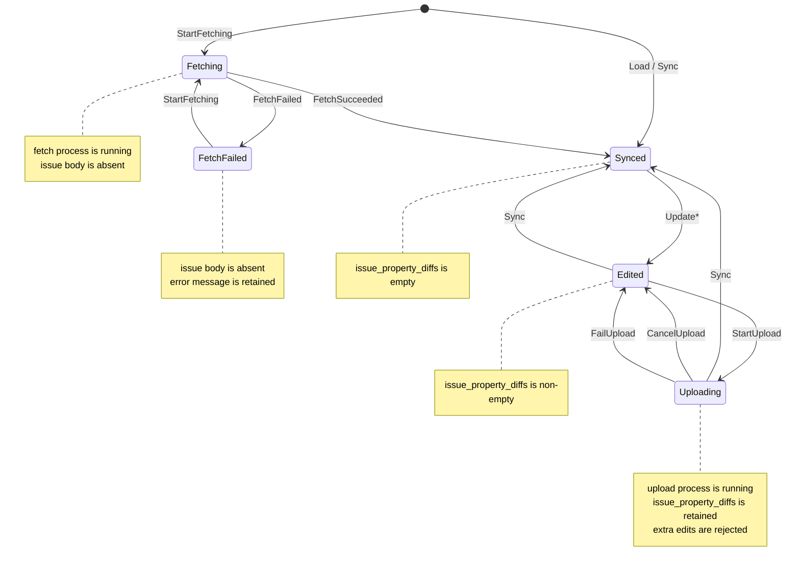

# 6. Issue詳細の非同期取得状態と表示Component

## Status

Accepted

## Context

Issue選択ポップアップは、Issue詳細をまだ取得していないIssueも一覧候補として表示する。
一覧用の `ProjectsIssue` はID、Project ID、subject、description、statusだけを持ち、詳細画面が必要とする完全な `Issue` ではない。
そのため、`ProjectsIssue` を選択した直後に `IssueDetailComponent` を生成すると、`IssueStore` に対象Issueが存在せず、描画時の不変条件に違反する。

既存の `AppComponent` は `IssueDetailComponent` を直接所有している。
`IssueDetailComponent` は対象IssueがStoreに読み込み済みであることを前提としており、未取得、取得中、取得失敗の表示を担当しない。
一方、Issue詳細のHTTP取得は非同期であり、取得開始からStoreへの登録までの間も安全に描画とキー入力を継続する必要がある。

現在の `IssueState` は `Synced`、`Edited`、`Uploading` で構成され、いずれもIssue本体がStoreに存在することを前提としている。
今回、完全な状態モデルの再設計は行わず、未取得Issueの初回fetchを表す暫定状態を追加する。

Issue選択、`y` によるポップアップの再表示、同じIssueの再選択が短時間に行われると、同じIssueへのfetchが重複する可能性がある。
重複した完了結果がローカル編集を上書きしたり、既存の `Sync` の不正遷移を起こしたりしないよう、fetch中の再取得抑止と完了Actionの状態検証が必要である。

プロジェクト別Issue一覧の取得、ページ状態、一覧用entityについてはADR 7で扱う。

## Decision

### IssueStateの暫定拡張

`IssueState` に `Fetching` と `FetchFailed` を追加し、概ね次の形とする。

```rust
pub enum IssueState {
    Fetching,
    FetchFailed { message: String },
    Synced,
    Edited,
    Uploading,
}
```

IssueStoreは、Issue IDごとのstateが存在してもIssue本体が存在しない状態を許容する。
状態とIssue本体の組合せには次の不変条件を設ける。

- `Fetching` と `FetchFailed` ではIssue本体を持たない。
- `Synced`、`Edited`、`Uploading` ではIssue本体を必ず持つ。
- `IssuePropertyDiff` とupload競合情報は、Issue本体を持つ状態だけで利用する。

親Storeは、Issue本体の有無とは独立して `Option<&IssueState>` を返すgetterを公開する。
未登録Issueは `None`、登録済みの各stateは `Some(&IssueState)` とする。
既存の `get_issue` は `Option<(&Issue, &IssueState)>` を返し、Issue本体を持つ場合だけ `Some` になる。
`Fetching` と `FetchFailed` では `get_issue` は `None` を返す。

### fetch用IssueAction

Issue詳細fetch用に、少なくとも次のActionを追加する。

```rust
StartFetching { id }
FetchSucceeded { id, issue }
FetchFailed { id, message }
```

状態遷移は次のとおりとする。

- Issue IDが未登録、または現在が `FetchFailed` のときだけ `StartFetching` を受理し、`Fetching` へ遷移する。
- `StartFetching` では同じIDの古いIssue本体、diff、upload競合情報を保持しない。
- 現在が `Fetching` で、Actionの要求IDと `issue.id` が一致するときだけ `FetchSucceeded` を受理し、Issue本体を登録して `Synced` へ遷移する。
- 現在が `Fetching` のときだけ `FetchFailed` を受理し、エラーメッセージを保持した `FetchFailed` へ遷移する。
- `Fetching` 中の再度の取得開始は無視する。
- `Synced`、`Edited`、`Uploading`、`FetchFailed`、または未登録状態へ遅れて到着した成功・失敗Actionは無視する。

ADR 2で定めた編集・保存の遷移を含め、今回のfetch状態を追加した `IssueState` 全体の状態遷移は以下とする。
図中の遷移ラベルはStoreにdispatchされるActionを表す。



`Fetching` への重複した `StartFetching` と、`Fetching` 以外へ届いたfetch完了Actionは状態を変えないため、図には遷移として記載しない。
また、後述する受理条件に反する `Sync` は内部ライフサイクル違反としてpanicするため、図には記載しない。

fetch完了にはGenerationを付与しない。
同じIssueについて同時に複数のfetchを開始しないことと、完了時に `Fetching` であることの検証を暫定的な競合防止規則とする。
明示的な再読み込みやcancelを追加し、同じIssueに複数世代のfetchを許可する場合はGenerationを導入する。

既存のfixture用 `Load` は、Issue本体とstateの両方が未登録の場合だけfixtureを登録して `Synced` にする。
いずれかが既に存在する場合は何も変更しない。
これにより、`Fetching` または `FetchFailed` のIDへ `Load` が届いても、Issue本体だけを追加して不変条件を壊すことはない。

upload成功等で使う `Sync` は、Issue IDが完全に未登録の場合と、`Edited`、`Uploading` から受理する。
`Synced`、`Fetching`、`FetchFailed` への `Sync` は内部ライフサイクル違反としてpanicする。
編集とuploadの既存状態遷移は維持する。
`FetchSucceeded` は未取得Issueの初回登録専用とし、既存Issueを置換する `Sync` と混同しない。

### Issue詳細取得usecase

Issue IDを受け取り、`RedmineClient::get_issue` を呼び出してfetch完了Actionを返すusecaseを追加する。
プロジェクト別Issueページ取得usecaseと同様、worker action senderはusecaseへ渡さない。

usecase呼び出し時にStoreの状態を確認する。

- 未登録または `FetchFailed` なら `StartFetching` を同期的にdispatchし、HTTP取得を行うFutureを返す。
- `Fetching`、`Synced`、`Edited`、`Uploading` なら新しいHTTP取得を開始しない。

`StartFetching` はその場ではconsumeせず、既存のmain loopが通常のupdateでconsumeする。
返すFutureは `Future<Output = IssueAction> + Send + 'static` とし、成功時は要求IDとIssue本体を含む `FetchSucceeded`、失敗時は表示用messageを含む `FetchFailed` を返す。
usecaseはClient結果の `issue.id` が要求IDと一致することも検証し、不一致を `FetchFailed` に変換する。
Tokio runtimeへのspawnとworker action channelへの送信はmainが担当する。
Clientは `Arc<C>` で渡し、`C: Send + Sync` を要求する。

重複抑止は、通常のユーザー入力イベント間について保証する。
1回の入力イベントまたは初期化処理から生成できるIssue詳細fetch effectは最大1個とし、AppComponentの単一 `pending_effect` がこれを検査する。
入力イベント後のupdateが `StartFetching` をconsumeしてから次の入力イベントを受け付けるため、次のイベントで同じIssueを選択しても `Fetching` が観測され、2本目のFutureを作らない。
同じupdateを挟まずusecaseを直接2回呼ぶことまではStore stateだけでは抑止しないため、その呼び出しは上位層の内部ライフサイクル違反とする。

### IssueComponent

`AppComponent` と `IssueDetailComponent` の間に `IssueComponent` を追加する。

`IssueComponent` は少なくとも対象 `IssueId` と `Option<IssueDetailComponent>` を保持する。
Storeの `IssueState` に応じて、次のComponentまたはWidgetを使用する。

- `Fetching`: Issue詳細は生成せず、「表示中です」とだけ表示するWidgetを使用する。
- `FetchFailed`: Issue詳細は生成せず、エラーメッセージと「`r` で再試行」を表示するWidgetを使用する。
- `Synced`、`Edited`、`Uploading`: `IssueDetailComponent` を使用する。
- 状態未登録: Issue詳細は生成せず、初回fetchのeffectを要求する。

`IssueDetailComponent` は、対象Issueが読み込み済み状態で、かつ現在保持していない場合だけ生成する。
`IssueComponent` は生成時に受け取った1つの対象Issueだけを、そのComponentが破棄されるまで表示する。
生成後に対象Issue IDを変更できる公開APIは設けない。
別Issueの遅延fetchが完了しても、そのIssueをStoreへ登録するだけで、現在の表示対象Issue IDは変更しない。

Component lifecycleとeffect生成点を次のように固定する。

- `IssueComponent::new` は対象IDとStoreを受け取り、未登録または `FetchFailed` なら `FetchRequested { id }` を戻り値として一度だけ返す。
- Issue選択ポップアップでIssueの選択が確定するたび、AppComponentは同じIssue IDの再選択であっても新しい `IssueComponent` を生成して置換する。
- ポップアップの表示中と、選択せずに閉じた場合は、背後の `IssueComponent` を保持する。
- `update` はStoreを読み、読み込み済みstateになったときの `IssueDetailComponent` 生成と、stateに応じた表示切替だけを行う。`update` からeffectを生成しない。
- `Fetching` と `FetchFailed` では `IssueDetailComponent` を保持しない。
- `render` はI/Oやeffect生成を行わない。

これにより、worker Actionをconsumeしたupdateでは詳細Componentの生成だけが行われ、キー入力後または初期化時にしか取り出されないAppEffectを取り逃がさない。

`IssueComponent` は次のキー入力を処理する。

- `IssueDetailComponent` が存在する場合、同じeventを最初に `IssueDetailComponent::process_event` へ渡す。Detailが結果を返した場合はその結果をそのまま上位へ委譲し、`IssueComponent` 自身は同じeventを解釈しない。
- Detailがeventを未処理（`None`）とした場合、またはDetailが存在しない場合だけ、`IssueComponent` 自身のキー入力として `y` と `r` を判定する。将来Detailと外側Componentでキーが競合した場合もDetailを優先する。
- `y`: stateにかかわらずIssue選択ポップアップを開く要求を返す。
- `r`: 現在のstateが `FetchFailed` の場合だけ、`FetchRequested { id }` のようなComponent結果をAppComponentへ返す。

現時点の `IssueDetailComponent` は `y` と `r` を処理しないため、これらは未処理eventとして外側の `IssueComponent` が担当する。

WidgetはStoreを直接参照せず、Componentから表示状態とmessageを受け取る。
AppComponentは `FetchRequested` をIssue詳細取得 `AppEffect` へ変換し、既存の単一 `pending_effect` へ登録する。
mainがeffectを処理するとusecaseが `StartFetching` をdispatchし、次の通常updateからmessageを消して「表示中です」へ切り替える。

### Issue選択後の遷移

Issue選択ポップアップがIssueを選択したら、AppComponentはポップアップを閉じる前にADR 7の `InvalidateGeneration` をdispatchする。
その後、ポップアップを除去し、選択されたIssue IDを対象とする新しい `IssueComponent` を生成してAppComponentへ設置する。

- 選択Issueが `Synced`、`Edited`、`Uploading` ならfetchせず、詳細表示へ切り替える。
- 選択Issueが未登録または `FetchFailed` なら詳細取得effectを上位層へ渡す。
- 選択Issueが `Fetching` なら追加fetchを開始せず、「表示中です」を継続する。

Issue選択確定を返す1回のキーイベントは、プロジェクト移動、ページ移動、再試行を同時には返さない。
したがって、選択確定時にIssue選択ポップアップが保持するページ取得effectは必ず空であることを内部不変条件として検査する。
AppComponentは `InvalidateGeneration` のdispatch、popupの除去、`IssueComponent::new(store, id)`、AppComponentへの設置の順に処理し、`new` が返した `FetchRequested` を詳細fetch effectへ変換して `pending_effect` へ登録する。
前の入力イベントで作られたeffectはそのイベント処理後にmainが取り出し済みであり、選択確定時に既存 `pending_effect` があれば内部ライフサイクル違反として検出する。

新しいComponentを生成してもStoreのstateは共有されるため、`Issueを選択する → yを押す → 同じIssueを選択する` 操作では、2回目の選択時に `Fetching` が観測され、同じIssueのHTTP取得を追加で開始しない。
`FetchFailed` のIssueを選択した場合は、`new` が再試行の詳細fetch effectを返す。

## Error Handling

Clientエラーはusecaseが `FetchFailed { id, message }` へ変換する。
`IssueStore` は対象Issueが現在 `Fetching` の場合だけ失敗を反映する。
`IssueComponent` はmessageと再試行案内を表示し、`r` で同じIssueの取得を再開する。

再試行開始時は `FetchFailed` から `Fetching` へ遷移し、以前のmessageを表示しない。
取得失敗は他のIssue本体、編集diff、upload状態、プロジェクト別Issue一覧へ影響させない。

## Rationale

`IssueDetailComponent` の外側に状態解決用Componentを置くと、詳細Componentが「Issueは必ずStoreに存在する」という既存の前提を維持できる。
RatatuiのrenderはStoreから導出した現在状態を毎frame描画し、HTTP I/OをComponentやWidgetへ持ち込まない。

`Fetching` と `FetchFailed` をIssueStoreに置くことで、非同期完了Actionを既存の一方向データフローで処理できる。
Componentだけにfetch状態を置く案では、Componentの生存期間を越えて届くworker Actionとの対応や失敗通知が複雑になるため採用しない。

`FetchSucceeded` を `Sync` から分離し、`Fetching` からだけ受理することで、遅延したfetchが既存Issueや編集内容を上書きすることを防ぐ。
完全な2軸Stateへ直ちに移行する案は、upload、diff、競合解決を同時に変更する必要があり、今回のIssue選択機能の範囲を超えるため採用しない。

## Consequences

`IssueState` が `String` を含むvariantを持つため、既存の `Copy` 前提は見直し、必要な箇所では参照またはcloneを使う。
IssueStoreのgetterと不変条件テストは、stateだけ存在してIssue本体が存在しない状態を扱う必要がある。

Store testでは次を確認する。

- 未登録と `FetchFailed` からだけfetchを開始できること
- `Fetching` 中の重複開始を無視すること
- 要求IDとIssue IDが一致する成功時だけIssueを登録して `Synced` になること
- 要求IDと異なるIssueを含む成功Actionを無視すること
- 失敗時にmessageを保持すること
- `Fetching` 以外へ届いた遅延成功・失敗を無視すること
- 遅延成功が `Edited` または `Uploading` のIssueを上書きしないこと
- 読み込み済みstateではIssue本体が必ず存在すること
- `Fetching` と `FetchFailed` へのfixture `Load` がIssue本体を追加しないこと
- `Synced`、`Fetching`、`FetchFailed` への `Sync` がpanicすること

Usecase testでは、同期的な `StartFetching` dispatch、前の開始Actionをconsumeした後の重複取得抑止、成功・失敗Actionへの変換、要求IDとresponse Issue IDの一致検証、senderをusecaseへ渡さないことを確認する。

`IssueComponent` testでは、状態ごとの表示切替、読み込み済みになったときだけの詳細Component生成、effect生成点、Detailが処理したeventを外側で再解釈しないこと、Detailが未処理または不在の場合の `y`、失敗時の `r`、別Issueの完了で表示対象を変えないことを確認する。
AppComponent testでは、ポップアップ表示中とcancel時に既存Componentを保持すること、選択確定時は同じIssue IDでもComponentを再生成すること、および `InvalidateGeneration`、popup除去、Component生成・設置、`pending_effect` 登録の順序と不変条件を確認する。
Widget snapshot testでは「表示中です」とfetch失敗・再試行案内を確認する。

## Alternatives Considered

### fetch状態をIssueComponentだけで保持する

表示との対応は直接的だが、worker ActionはComponentの生存期間を越えて到着する。
StoreにIssueがないまま失敗だけをComponentへ通知する別経路も必要になるため採用しない。

### 既存のSync Actionをfetch成功にも使う

Action数は増えないが、`Sync` は既存Issueの置換やupload完了にも使われる。
重複fetchの遅延結果が編集済みIssueを置換し得るため、初回取得専用の `FetchSucceeded` を採用する。

### IssueStateを直ちに完全な2軸へ分離する

同期・編集状態とfetch/upload進行状態を独立させれば、Generationを含む厳密な非同期管理が可能になる。
ただし既存のdiff、upload、競合解決の状態遷移全体へ影響するため、今回は暫定variant追加に留める。

## Future Work

- `Synced / Edited` をIssue本体とdiffから導出し、fetch/upload進行状態とGenerationを別軸で管理する
- 同じIssueへの明示的な再取得、cancel、複数世代fetchを導入する場合のstale completion排除
- fetchとuploadが同時に要求された場合の状態遷移整理
- fetch失敗messageの構造化と、ログ向け情報・UI向け文言の分離
- 同一Issue再選択時のcursor、scroll、focusの復元をAppComponent以上のlayerで扱う

現時点では通常のApp lifecycleで同じIssueに複数のfetchを同時に開始せず、`Fetching` からの完了だけを受理することで競合を防止する。
