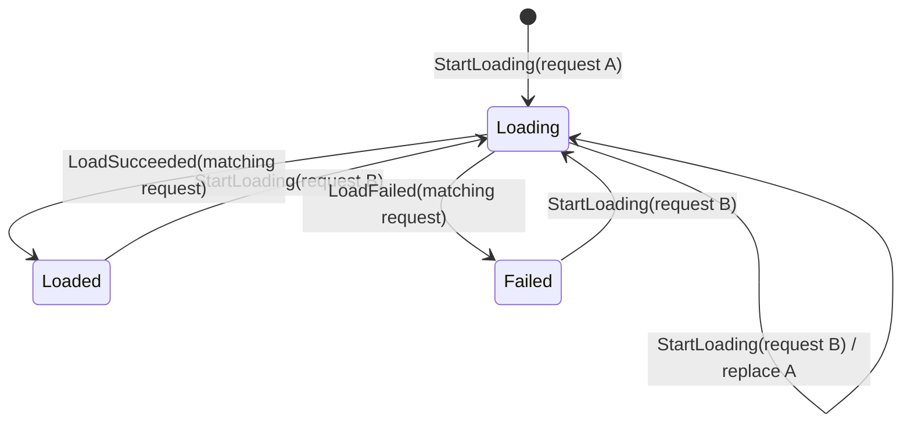

# 7. Issue選択ポップアップのプロジェクト別Issue取得とページ管理

## Status

Accepted

## Context

Issue選択ポップアップでは、詳細未取得のIssueもプロジェクトごとに一覧取得して表示する。一覧用の`ProjectsIssue`はIssue ID、Project ID、subject、description、statusだけを持ち、既存の`IssueStore`とは別に保存する。

Issue列は一度に1ページだけを表示する。連続スクロールと先読みは、表示中にサーバー側でIssueが追加された場合にoffsetの重複・欠落を起こしやすいため採用しない。選択中プロジェクトのpage 1から開始し、境界入力で前後ページを明示的に取得する。

同じexact keyを再取得する通信は重なり得る。例えばA→B→Aと素早くプロジェクトを切り替えると、最初のAと2回目のAの完了順は保証されない。一方、AとBは独立して完了・キャッシュできる必要がある。popup全体のgenerationでは粒度が粗く、Actionのconsume前に新世代を共有するライフサイクルも複雑になる。

## Decision

### 一覧用entityとClient

`ProjectsIssue`を`src/entities/`に置き、同じIssueが`IssueStore`に存在しても別に保存する。

```rust
ProjectsIssue {
    issue_id: IssueId,
    project_id: ProjectId,
    subject: String,
    description: String,
    status_id: IssueStatusId,
}
```

`RedmineClient`へ指定プロジェクト・ページのIssue一覧取得を追加する。`GET /issues.json`へ`project_id`、`status_id=*`、`sort=id:desc`、`limit=50`、1始まりの`page`を渡す。戻り値はIssue一覧、`total_count`、`offset`、`limit`を含む。

Clientはstatus objectを`IssueStatusId`へ変換し、API response DTOをdomain entityへ漏らさない。
limitが50、offsetが`(page - 1) * 50`、各IssueのProject IDが要求値と一致することを検証し、不一致は`RedmineClientError::Client`とする。
期待offsetはchecked arithmeticで計算し、overflowするpageも`RedmineClientError::Client`とする。
空の範囲外ページを正常なcollection responseとして許容するため`offset <= total_count`は検証しない。
並び順、Issue IDの一意性、`issues.len() <= limit`もRedmineを信頼し、Clientでは検証しない。

### exact keyとページ状態

StoreはProject IDとpageの組をexact keyとして扱う。generationはkeyに含めない。

```rust
HashMap<(ProjectId, NonZeroUsize), ProjectIssuesPageState>

enum ProjectIssuesPageState {
    Loading { request_id: ProjectIssuesRequestId },
    Loaded {
        issues: Vec<ProjectsIssue>,
        total_count: usize,
        offset: usize,
        limit: usize,
    },
    Failed { message: String },
}
```

`ProjectIssuesRequestId`は一般的なdomain Value Objectではなく、`ProjectIssuesStore`のAction protocolで開始Actionと完了Actionを対応付ける相関IDである。
そのため`src/vos/`には置かず、`stores/project_issues_store` moduleでAction・page stateとともに定義し、`stores` module経由でページfetch Usecaseへcrate内公開する。アプリ外へ公開するAPIにはしない。
値はUUID v4で、等値比較だけに使う。大小や発行順には意味を持たせない。UUID v4の衝突確率は実用上無視できるため、中央採番器は設けない。ページfetch Usecaseは呼び出しごとに新しいIDを同期的に生成する。

Actionは次の情報を持つ。

```rust
StartLoading { request_id, project_id, page }
LoadSucceeded { request_id, project_id, page, result }
LoadFailed { request_id, project_id, page, message }
```

`StartLoading`はexact keyが未登録、`Loading`、`Loaded`、`Failed`のいずれでも、`Loading { request_id }`へ置き換える。これが明示的なrefetchであり、`ClearPage`は設けない。完了Actionは同じexact keyが`Loading`で、その`request_id`が一致する場合だけ受理する。他のexact keyの状態には影響しない。



一致しないrequest IDの完了Actionは無視する。A/page1 request X、B/page1 request Y、A/page1 request Zの順に開始した場合、A/page1はZだけを受理し、B/page1はYを独立して受理できる。XのHTTP自体はcancelしない。

Storeはexact-key getterとLoaded metadataを公開する。表示page、前後ページ、navigation可否、現在focusなどComponentの意図は保持・計算しない。取得開始可否を「entryがないこと」で判定するqueryも設けない。明示的なfetchは現在状態にかかわらず新しいrequest IDで開始できる。

### Usecaseと非同期処理

ページ取得usecaseはProject IDと`NonZeroUsize`のpageを受け取ると、次を同期的に行う。

1. UUID v4の`ProjectIssuesRequestId`を生成する。
2. `StartLoading { request_id, project_id, page }`をdispatchする。
3. 同じ`request_id`を捕捉し、成功または失敗Actionを返すFutureを構成する。

Usecaseは`Future<Output = ProjectIssuesAction> + Send + 'static`を返す。worker sender、Tokio runtime、spawnはmainが管理し、usecaseへ渡さない。Clientは`Arc<C>`で渡し、`C: Send + Sync`を要求する。開始Actionは同期dispatchするがその場ではconsumeせず、main loopの通常updateへ任せる。

Componentと`AppEffect`は`project_id`と`page`だけを保持し、request IDを持たない。AppComponentがeffectを取り出してusecaseを呼ぶ時点で、usecaseがIDを発行する。AppComponentはrequest ID、generation、Clear/Invalidateの順序を管理しない。

### Componentの表示pageと取得要求

Componentはpopup生成時のProject一覧snapshotと、プロジェクトごとの表示pageだけを保持する。

```rust
HashMap<ProjectId, NonZeroUsize>
```

初期選択プロジェクトは次の2段階で決める。

1. フォーカス中Issueが`IssueStore`に存在し、そのProject IDがsnapshotに存在すれば、そのProject
2. それ以外はProject ID昇順の先頭

`ProjectsIssue`のキャッシュから初期選択Projectを探索しない。プロジェクトが0件なら初期effectを持たない。

popup生成時は初期Projectのpage 1を要求する。プロジェクト切替、前後ページ移動、失敗時の`r`でも、対象Project IDとpageの新しいeffectを要求する。A→B→AではAを再取得し、Usecaseが各fetchへ異なるrequest IDを付ける。表示page MapはProjectごとに保持するが、Storeのキャッシュ存在を理由にプロジェクト切替時のfetchを省略しない。
popupを閉じて開き直すと新しいComponentと表示page Mapを作り、すべてpage 1から始める。

同じページへのfetchがすでに`Loading`でも、新しい明示要求は新しいrequest IDで置き換えられる。ただし1回の入力イベントからeffectは最大1個とし、AppComponentの単一`pending_effect`を上書きしない。
`IssueSelectPopupComponent::take_effect`は保持したeffectを一度だけ返す。

popupを閉じるときはpopupをstackから除去するだけである。generation更新、全ページ破棄、exact-key clearは行わない。Storeにある他Project・他pageのキャッシュは独立して保持される。

### ページ移動と表示

Componentは全ProjectのStore状態を複製しない。現在のProject IDと表示pageからexact-key getterを参照し、描画や境界入力の瞬間に必要なviewを導出する。

- 先頭Issueでさらに`k`: page > 1ならchecked subtractionで前pageを求め、fetchする。
- 最終Issueでさらに`j`: Issue一覧が空でなく、`offset.saturating_add(issues.len()) < total_count`ならchecked additionで次pageを求め、fetchする。
- 前または次のpageが存在しない境界入力はキーを消費するだけで、effectを生成しない。
- 移動先pageをComponentへ保存し、Issue cursorを0へ戻す。
- page 2以降が空でも`k`で前pageへ戻れる。空pageでは`j`を開始しない。
- Project切替時もIssue cursorを0へ戻す。

`FocusState`はStore metadataやnavigation policyを持たず、通常カーソル移動、先頭での追加`k`、末尾での追加`j`、Project切替、`r`をComponentへ通知する。

`Loading`ではIssue列に「読込中です」とだけ表示し、以前の内容やpreviewを表示しない。`Failed`ではmessageと`r`による再試行案内を表示する。`Loaded` 0件では「Issueはありません」と表示する。WidgetはStoreを直接参照しない。

Project列にfocusがあるとき、現在pageが`Loading`、`Failed`、未取得、またはpage 1の`Loaded` 0件なら、`l`でIssue列へ移動しない。
`r`による再試行は、選択中Projectの現在pageが`Failed`ならProject列・Issue列のどちらにfocusがあっても受け付ける。

Project列には`VerticalScrollWidget`を使用する。Issue列は最大50件の現在pageだけを表示する。Issue列から開始した取得中・失敗中もIssue列focusを維持し、`h`でProject列へ戻れる。

### 既存Issueの表示値

`Loaded`の`ProjectsIssue`と同じIssue IDが`IssueStore`に存在する場合、Issue列とpreviewのsubject/descriptionには`IssueStore`の値を使う。存在しなければ`ProjectsIssue`の値を使う。statusは今回上書きしない。

### main loop

既存の共通effect処理点を維持する。

1. worker channelからActionをDispatcherへ移す。
2. queued Actionを1件ずつconsumeし、各Action直後に`AppComponent::update`する。
3. `AppComponent::take_effect`を呼び、effectがあればusecaseを開始する。
4. draw、event poll/read、`handle_key_event`を行う。
5. キー処理後もqueued Actionをdrain/updateし、ActionがなくてもComponent更新を1回行う。

Usecaseが同期dispatchした`StartLoading`は次の通常drainでconsumeされる。request IDは開始ActionとFutureにすでに閉じ込められているため、dispatchとconsumeの間にStoreから識別子を読み直す必要はない。
`AppComponent::new`直後にはComponent初期化用の`AppComponent::update`を一度呼ぶが、queued Actionはconsumeしない。
popupの初期effectはComponent生成時に`pending_effect`へ移し、初期effect専用handlerを設けず、最初のmain loopの共通effect処理点で開始する。
この処理点はdrawと最初のevent poll/readより前にあるため、ユーザーの初回入力より先に初期fetchを開始できる。

## Error Handling

Clientエラーは同じrequest IDを持つ`LoadFailed`へ変換する。Storeは現在のexact keyが同じrequest IDの`Loading`である場合だけ`Failed`へ遷移する。古い成功・失敗は無視し、他のexact keyには影響させない。

再試行は同じProject ID・pageで新しいfetchを開始し、`Loading { new_request_id }`へ直接置き換える。不完全なページ結果は公開しない。

## Rationale

fetch単位のrequest IDにより、競合の範囲を実際に置換され得るexact keyへ限定できる。popup全体を無効化すると独立したBの取得結果まで捨てるが、request ID方式ではAの先行要求だけを拒否できる。

UsecaseがIDを生成すると、開始ActionとFutureの完了Actionを同じスコープで構成できる。AppComponentはeffectのルーティングとmain lifecycleだけを担当し、非同期相関IDを管理しない。

UUID v4は追加の中央状態や連番overflowを持たず、Actionのconsume前にも確定できる。値の順序を使わないことを型とtestで固定する。

Componentに表示意図、Storeにexact-key取得結果を置くことで、navigation policyとキャッシュを分離できる。

## Consequences

Store testでは少なくとも次を確認する。

- 未登録、Loading、Loaded、Failedのどれも新しい`StartLoading`で置き換えられること
- 同じexact keyでrequest X→Z後、Xの成功・失敗を無視しZだけを受理すること
- 異なるexact keyのrequestは独立して完了できること
- Loaded metadataと空ページを保持できること
- generation、Invalidate、ClearPage、can-fetch absence queryが存在しないこと

Usecase testでは、呼び出しごとに異なるrequest IDを生成すること、開始Actionと完了Actionで同一IDを使うこと、成功・失敗変換、senderを受け取らないことを確認する。乱数の具体値や大小には依存しない。

Component testでは、初期選択規則、初期page 1、popup再生成時のpage 1 reset、Projectごとの表示page、A→B→Aで各fetch effectを出すこと、`take_effect`のone-shot、pageがない境界でのキー消費、Project列からIssue列へのfocus抑止、両columnからのretry、Loading/Failed/空page、既存Issueの表示優先、Project列scrollを確認する。App/main testでは、Component effectがProject ID/pageだけを持つこと、AppがClear/Invalidateをdispatchしないこと、初期Component updateがActionをconsumeしないこと、初期effectが共通処理点で最初の入力より前に開始されること、usecase開始Actionが通常drainでconsumeされることを確認する。

## Alternatives Considered

### popup全体のGeneration

popup終了やProject切替で全cacheを無効化すると、異なるexact keyの独立した通信まで破棄する。Actionを投げた側と非同期開始側で新generationを共有するための管理も必要になるため採用しない。

### ClearPageして未登録キーだけ取得する

Loadingをclearできないと先行要求を置き換えられず、clearすると完了Actionを区別する識別子が必要になる。request ID付き`StartLoading`で直接置き換える方が単純なため採用しない。

### Componentがrequest IDを発行する

ComponentやAppEffectが非同期相関の詳細を知る。開始Actionと完了Actionを構成するUsecaseに閉じ込められるため採用しない。

### 連番ID

実用上は可能だが、中央採番状態、overflow、発行順の意味を誤って使う余地が生じる。UUID v4を等値比較だけに使う。

## Future Work

- filter条件と、filterを含むcache key・取得状態の設計
- 「取得結果が空」と「未実行」のUI上の区別
- ポップアップ表示中のProject一覧再同期
- server側追加・削除でoffsetが変化した場合の案内
- navigation cacheの保持上限・eviction
- 進行中HTTP requestのcancel
