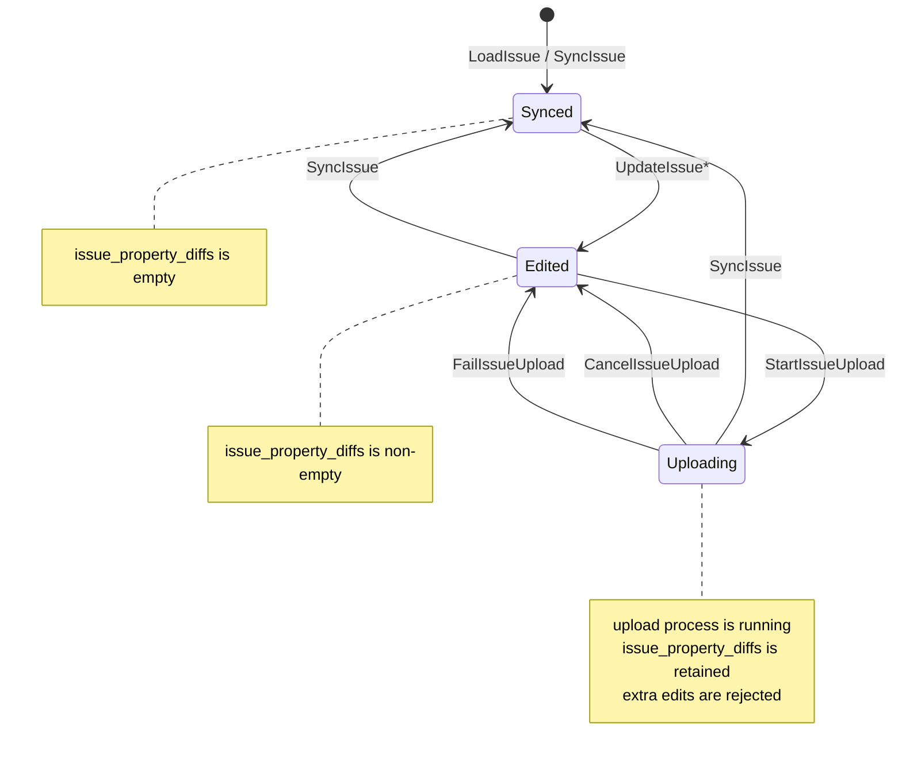

# 2. Issue 保存フローと IssueState の管理方針

## Status

Accepted

## Context

`redmine-tui` は現在、`datas/` の YAML fixture を読み込むローカルプロトタイプとして実装されている。
今後 Redmine サーバーへ接続し、TUI 上で編集した内容を保存できるようにする。

この TUI から編集可能な Redmine 由来の entity は、当面以下の2種類に限定する。

- `Issue`
- `Journal`

`IssueDetailComponent` 表示中に `Ctrl+S` が押された場合、最終的には issue とその journal の双方を保存対象にする。
ただし本ADRでは issue の保存、特に既存 issue の更新フローだけを扱う。
Journal の新規追加・編集・削除はこのADRの対象外とする。

保存処理では、ローカル編集後にサーバー側でも同じ issue が変更されている可能性がある。
そのため、ローカル差分をそのまま送信するのではなく、保存開始時にサーバーから現在の issue を取得し、property 単位で競合を検出する。

現状の `IssueState` は `issue_property_diffs` の有無から `Synced` / `Updated` を導出している。
しかし保存中状態は diff の有無だけでは表現できないため、Redmine 接続対応に向けて `IssueState` を Store が管理する明示的な状態として扱う必要がある。

なお Redmine REST API では、既存 issue の更新は `POST` ではなく `PUT /issues/{id}.json` に相当する。
アプリ内部では「upload」または「save」と呼び、API adapter 層で Redmine の HTTP method に変換する。

## Decision

Issue の保存フローを以下のように定義する。

1. `IssueDetailComponent` 表示中に `Ctrl+S` が押される。
2. 保存開始 action を dispatch し、対象 issue の `IssueState` を `Uploading` にする。
3. サーバーから現在の issue を取得する。
4. 取得エラーが発生した場合は保存を中断し、エラーメッセージを表示する。Store 上の issue と `issue_property_diffs` は更新せず、`IssueState` は `Edited` に戻す。
5. 取得に成功した場合、対象 issue の `issue_property_diffs` を property ごとに畳み込み、「どの property が、何の状態から、最終的に何に変更されたか」を計算する。
6. 畳み込み後に net change がない property は保存対象から除外する。
7. 保存対象 property ごとに、ローカル編集前状態、ローカル編集後状態、サーバー現在状態を比較する。
8. 競合がない property は upload payload に含める。
9. 競合がある property は競合解決 component に表示し、サーバー現在状態を優先するか、ローカル編集後状態を優先するかをユーザーに選択させる。
10. ユーザーが競合解決を中断した場合は保存を中断する。Store 上の issue と `issue_property_diffs` は更新せず、`IssueState` は `Edited` に戻す。
11. 競合解決後の payload をサーバーへ送信する。
12. upload エラーが発生した場合は保存を中断し、エラーメッセージを表示する。Store 上の issue と `issue_property_diffs` は更新せず、`IssueState` は `Edited` に戻す。
13. upload に成功した場合は、Redmine の更新レスポンスに含まれる issue を `SyncIssue` action に詰めて dispatch する。
14. `SyncIssue` は Store 上の issue を丸ごと置き換え、対象 issue の `issue_property_diffs` を破棄し、`IssueState` を `Synced` にする。

Issue の状態は以下の3状態とする。

- `Synced`
  - サーバーから読み出した issue で Store が更新された後、ローカル編集が加わっていない状態。
  - 対象 issue の `issue_property_diffs` は空である。
- `Edited`
  - `Synced` からローカル編集が行われた状態。
  - 対象 issue の `issue_property_diffs` は非空である。
- `Uploading`
  - `Edited` から `Ctrl+S` が押され、保存プロセスを実行中の状態。
  - 対象 issue の `issue_property_diffs` は保持する。
  - 保存成功、保存失敗、取得失敗、ユーザー中断のいずれかで別状態へ遷移する。

`IssueState` の状態遷移は以下とする。
図中の遷移ラベルは Store に dispatch される action を表す。

`Uploading` 中は同じ issue への追加編集を禁止する。
UI 側では編集操作を無効化し、Store 側でも `Uploading` 中の issue 更新 action を適用しない方針とする。
保存開始時点の diff と保存中に追加された diff を世代管理する設計は、初期実装では採用しない。

競合判定は property 単位で行う。
畳み込み後の property diff を `(before, after)`、サーバーから取得した値を `server` としたとき、扱いは以下とする。

| 条件 | 扱い |
| --- | --- |
| `before == after` | net change なしとして保存対象から除外する |
| `server == before` | 競合なし。`after` を upload payload に含める |
| `server == after` | 競合なし。すでに同じ状態なので upload payload から省略してよい |
| `server != before && server != after` | 競合あり。ユーザーに `server` と `after` のどちらを採用するか選択させる |

Issue 保存に関わる action は、既存の `LoadIssue` とは分けて定義する。

- `StartIssueUpload`
  - 保存プロセス開始を Store に反映する。
  - 対象 issue を `Uploading` にする。
- `CancelIssueUpload`
  - 保存中断を Store に反映する。
  - 対象 issue を `Edited` に戻す。
- `FailIssueUpload`
  - 取得エラーまたは upload エラーを Store に反映する。
  - 対象 issue を `Edited` に戻し、表示用エラー状態を更新する。
- `SyncIssue`
  - 保存成功後、サーバー由来の issue を Store に反映する。
  - Store 上の issue を丸ごと置き換え、対象 issue の diff を破棄し、状態を `Synced` にする。
  - Redmine 接続後は、初期ロードや結合テストの Store 準備にも使用する。

`LoadIssue` は fixture からの読み込み専用の暫定 action として扱い、Redmine 接続後に削除する。
結合テストで Store に issue を準備する場合は `SyncIssue` を使用する。
万が一 fixture 由来の issue を使う必要がある場合も、fixture から作った `Issue` を `SyncIssue` に渡して対応する。

保存成功後の `SyncIssue` には、Redmine の更新レスポンスに含まれる issue を使用する。
更新後に再度 GET すると、保存プロセスの不安定性とターンアラウンドタイムが増えるため、初期実装では採用しない。

保存中、保存失敗、競合ありなどのメッセージは component local state として管理する。
現時点では i18n を考慮していないため、Store にメッセージ文言を持たせる設計は採用しない。

`IssueState` は今後も Store で定義する enum とし、`Issue` entity や value object とは別レイヤで管理する。
`IssueState` は永続データそのものではなく、TUI の同期状態と保存プロセス状態を表す application state である。

`IssuePropertyDiff` は value object として扱う。
`Issue` entity に `IssuePropertyDiff` を保持させない。
ただし、`IssuePropertyDiff` を `Issue` に apply / revert する純粋関数は `Issue` entity に追加する。
この関数は外部I/Oや Store 更新を含まず、`Issue` と diff から新しい `Issue` または変更後の値を得る domain logic として扱う。
`Issue` が `IssuePropertyDiff` の型を知ることは許容するが、`Issue` が未保存 diff を所有することは許容しない。

## Rationale

保存前にサーバーから issue を再取得することで、ローカル編集開始後にサーバー側で変更された property を検出できる。
Issue 全体を単純に上書きすると、他ユーザーまたは別クライアントの変更を失う可能性がある。
一方、property 単位で diff を畳み込み、必要な property だけを比較すれば、競合していない変更はそのまま保存できる。

競合条件を `server != before` だけにすると、サーバーがすでにローカル編集後と同じ値になっている場合まで競合として扱ってしまう。
そのため、競合は `server != before && server != after` の場合だけとする。
これにより、不要な競合解決 UI を避けられる。

`Uploading` を Store の `IssueState` として持つのは、保存中であることを `IssueDetailComponent` の表示や入力制御に反映するためである。
この状態は domain entity の性質ではなく、TUI の application state である。
そのため `Issue` entity には含めない。

保存成功時に `SyncIssue` で issue を丸ごと置き換えるのは、サーバー側で `updated_on` や関連表示値が変わる可能性があるためである。
部分的に Store を書き換えるより、サーバー由来の正規状態を Store に反映する方が、保存後の `Synced` 状態を明確にできる。
このとき、更新レスポンスを使えば、保存成功後の再取得を避けられる。
追加の GET はネットワークエラー、レスポンス順序、処理時間の揺らぎを増やすため、保存フローを不必要に不安定にする。

`Uploading` 中の追加編集を禁止するのは、初期実装の状態管理を単純に保つためである。
保存中編集を許可すると、保存開始時点の diff と保存中に追加された diff を分けて扱う必要があり、競合解決、エラー復帰、成功時の diff 破棄条件が複雑になる。

保存メッセージを component local state に置くのは、メッセージが現在の表示都合に近いためである。
今後 i18n や通知履歴を扱う場合は Store 側に状態を持つ可能性があるが、現時点では対象外とする。

## Consequences

Store は issue 本体と `issue_property_diffs` に加え、issue ごとの明示的な `IssueState` を管理する必要がある。
現在のように diff の有無だけから `IssueState` を導出する設計は変更する。

`IssueDetailComponent` は `IssueState::Uploading` を見て、保存中表示と編集不可状態を表現する。
Widget へは単純な `synced: bool` ではなく、表示用に変換した状態を渡すことを検討する。

保存フローにはサーバー取得、競合判定、競合解決 UI、upload、Store sync が含まれる。
これらは render path に入れず、component から action または effect を発行し、usecase / adapter 層で非同期処理として扱う。

保存成功後に再取得を行わないため、Redmine 更新レスポンスから Store 更新に必要な issue を構築できる adapter 実装が必要になる。

保存メッセージは component local state に置くため、複数 component から同じメッセージを参照する用途には向かない。
その要件が出た場合は、Store に通知状態を持つ設計を再検討する。

`LoadIssue` は Redmine 接続後に削除する。
初期ロードとテスト準備は `SyncIssue` に集約される。

Issue に関連する action が増えるため、将来的に Issue 専用の子 Store へ切り出す余地がある。
ただし初期実装では、既存の `Dispatcher` / `Store` 構成を保ち、保存フローに必要な action と state を追加する。

Journal の保存はこのADRでは扱わない。
ただし `Ctrl+S` の最終的な意味は issue と journal の双方の保存であるため、今後 journal の新規追加・編集・削除を設計するときは、この issue 保存フローとの合成を検討する。

## Open Questions

- 競合解決 component の具体的な表示形式とキー操作。
