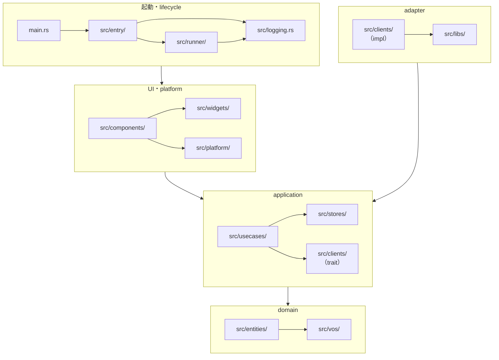
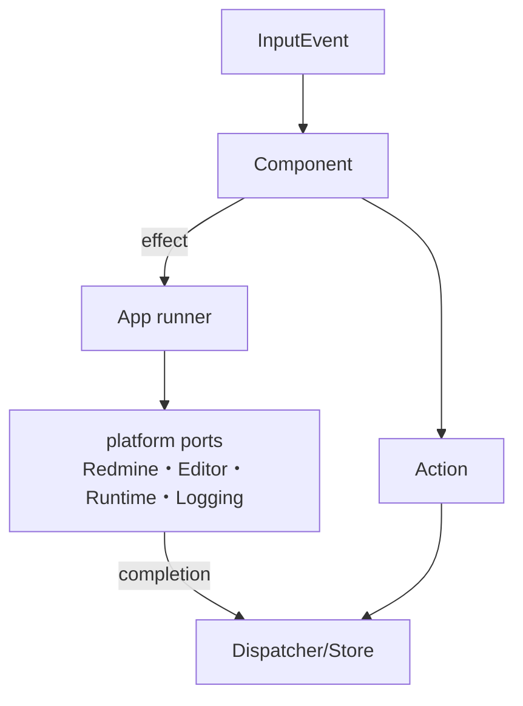

# Agent 実装ガイド

この文書は、agent が本リポジトリを読む・変更する際のアーキテクチャ前提をまとめる。
詳細な意思決定の背景は `docs/adrs/` を参照する。

## ディレクトリ構成

- `src/main.rs`
  - Cargo feature で native/Web の entry point を選ぶ。feature と target が不一致（`native` と `web-demo` の同時指定、非 wasm32 target での `web-demo` 等）なら `compile_error!` で compile 不能にする。
- `src/entry/`
  - native/Web の起動処理を置く。
- `src/stores/`
  - `store.rs` は、子 Store ・子 Action の統合を行う。外部からはこのファイルからエクスポートされる Store と Action を公開インターフェースとして用いる。
- `src/usecases/`
  - アプリ固有の操作を置く。Store・Client の情報統合、および同期的な Dispatch や非同期タスクによる Action の形成を担う。
  - 非同期 usecase について、同期的な Action dispatch はここで即座に行い、非同期で形成する Action は `Future` として返却する形が基本形である。`Store` を直接書き換えず、`Dispatcher::dispatch` を介して Action を積む。`runner` が Future を platform の runtime port（native は Tokio、Web は `spawn_local`）で起動し、完了 Action を Dispatcher へ戻す。
- `src/clients/`
  - 外部プロセスとの通信を行う。
  - `redmine/base.rs` は `RedmineClient` trait を定義し、 Redmine との通信のインターフェースを定義する。`redmine/default.rs` は `DefaultRedmineClient`（実 HTTP 実装）を定義する。
  - `redmine/demo/` は `DemoRedmineClient`（実 HTTP を行わず fixture を埋め込む memory mock）を定義する。
- `src/components/`
  - TUI の画面部品を置く。
  - `app.rs` は全体 component と popup stack を統括する。
  - `issue/` はIssue取得状態を解決する外側componentを置き、`issue/detail/` は読み込み済みIssueの詳細画面とその子componentを置く。
  - `*_popup/` は popup component を置く。
- `src/platform/`
  - native/Web の platform adapter を置く。
  - input（`InputEvent`）、runtime（`BackgroundSpawner`）、host（`PlatformHost`）、editor（`TextEditor`）の各 port。
- `src/runner/`
  - native/Web で共有する application lifecycle を置く。
- `src/entities/`
  - Redmine 由来の永続的な domain entity を置く。
- `src/vos/`
  - ID、差分、journal detail などの value object を置く。
- `src/widgets/`
  - 複数 component から使う汎用 widget を置く。
- `src/libs/`
  - YAML読み込みなど、外部表現から domain data へ変換する補助処理を置く。
- `src/logging.rs`
  - `initialize_logging`（native は file、Web は browser console）と `trace_dbg!` などの補助マクロを置く。
- `src/test_support.rs`
  - snapshot rendering や test fixture を置く。
- `src/snapshots/`
  - insta snapshot を置く。
- `docs/adrs/`
  - アーキテクチャ判断の記録を置く。

## ディレクトリ間の依存

矢印は依存する側から依存される側への向き。
上の層は下の層に依存してよく（層を飛ばしてもよい）、下の層から上の層への依存はない。
層内の依存は個別の矢印で表す。
`src/clients/` のうち `usecases` が使うのは `redmine/base.rs` の `RedmineClient` trait などのインターフェース定義だけで、これを application に置く。実装（`default.rs` の `DefaultRedmineClient`、`demo/` の `DemoRedmineClient`）と外部表現の変換（`src/libs/`）は `adapter` に置き、実装は起動処理が組み立てて渡す。
例として、`runner` は `components`・`usecases`・`stores`・`clients`・`vos` に、`platform` は completion を `Action` として dispatch するため `stores` に依存する。



`usecases` は `components` に依存しない。
Component から usecase の関数を呼ぶことはあるが（例: `app.rs` が `issue_popup_options` や `redmine::{cancel_issue_upload, continue_issue_upload}` を呼ぶ）、逆方向の依存は発生させない。
同様に `clients` は `stores` にも `usecases` にも依存せず、`RedmineClient` trait と HTTP 実装（`DefaultRedmineClient`）、`DemoRedmineClient` を提供する。`DemoRedmineClient` の fixture は `src/libs/yaml.rs` の parser を使うため `clients` から `libs` への依存がある。

## Flux を参考にした構成

本リポジトリは厳密なFlux実装ではない。
Action を Dispatcher へ送り、Dispatcher が Store を更新し、Store 更新後に Component を update する、という一方向データフローを基本にした構成である。

Store の更新は原則として Dispatcher を介して行う。
初期セットアップを除き、action の処理と component の `update` は交互に行う。
これは意図した lifecycle であり、全 action を drain してから一度だけ update する設計ではない。

厳密なFluxとの差分として、以下を許容する。

- Store 更新通知は pub/sub ではなく、上位層が `consume_action -> update` を明示的に呼ぶ。
- `Dispatcher` は action queue と `Store` を内部に持つ。
- 親 `Store` は Issue の状態と更新処理を非公開の `IssueStore` に委譲する。
- Component と usecase は `IssueStore` を直接参照せず、親 `Store` の Issue getter を通して entity、同期状態、diff、競合情報を取得する。
- focus、cursor、scroll、render cache などの同期的な UI state は Store ではなく Component / FocusState に保持する。
- 親子 Component 間の focus 遷移は Store / Action を経由せず、`process_event` の戻り値と `focus_event` で直接処理する。
- editor 起動、Redmine への非同期取得・保存などの外部副作用は `AppEffect` として Component から取り出し、`runner` 側で実行する。Redmine 関連の `AppEffect` は `usecases::redmine` の関数を platform の runtime port（native は Tokio、Web は `spawn_local`）で spawn し、完了 Action を Dispatcher に戻す。
- `create_widget(&Store)` で Store を参照して表示用 entity を取得してよい。

Store は、失敗または Action の不受理に見える分岐を以下に区別して扱う。

- 異常系: 自プロセスの制御破綻を示す状態機械違反。`panic!` で即座に停止する。異常系を `Result` で呼び出し元へ返すのは、Flux を参考にした一方向データフローでは dispatch 時点と consume 時点が分離しておりエラーを返す先がないため採用しない。
- 準異常系: 外部プロセスや外部データ起因の復帰可能な失敗。message を Action に載せ、状態復帰と notice によるユーザー通知を行う。失敗後の再試行に必要な状態がある場合は、失敗 Action によって対象の状態機械を再試行可能な状態へ戻し、message を状態の一部として保持する。
- stale completion: 重複を許した非同期要求の追い越し。request ID の一致判定で破棄し、暗黙の状態判定では破棄しない。現時点でこれに該当するのは `ProjectIssuesStore` のみ。`IssueAction` と `JournalAction` は重複を事前条件で排除するため、想定した状態以外へ着弾した完了は stale completion として捨てず異常系として拒否する。
- マージ戦略: サーバー由来のデータをローカルへ取り込む際、ローカル編集を保護するために更新を適用しない意図的な no-op。`JournalStore::merge_sync_fetched` の dirty entry 保護がこれにあたる。
- 冪等 no-op: 同じ `NoticeId` の再追加など、Action 自体が冪等であることを契約として持つ正常な no-op。stale completion とマージ戦略は同じ no-op の見た目になりやすいため独立して扱う。

getter 契約は、API が表す状態と cardinality で決める。不在が示す意味が異なるため、entity の種類だけで一律には決めない。

- strict 単体取得: 存在が呼び出し元の事前条件である getter は `get_xxx` とし、参照を直接返し、不在は異常系として `panic!` する。
- 状態・cardinality を表す `Option`: 読み込み状態、ページの未要求、0 件・1 件など、不在そのものが状態や cardinality を表す取得は `Option` を返す。`IssueStore` と `JournalStore` の単体 getter では、`Option` を返すものを `try_get_xxx` と命名する。呼び出し側が取得値の存在を特定の経路で前提する場合は、無言の `unwrap()` ではなく `expect(...)` で不変条件を説明する。
- master snapshot の `Option`: 起動時に一度だけ同期するマスターデータ（`IssueStatus` など）は、起動後に取得した Issue や Journal がスナップショットに存在しない ID を参照し得るため陳腐化で欠損し得る。単体のマスターデータ getter は `Option` を返し、呼び出し元は表示上の fallback で処理する。

Issue の getter は、取得済みの本体と読み込み状態を分けて扱う。

```rust
enum IssueState { Synced, Edited, Uploading }
enum IssueFetchState { Fetching, FetchFailed { message: String } }

fn get_issue(&self, id: IssueId) -> (&IssueAggregate, IssueState);
fn try_get_issue_state(&self, id: IssueId) -> Option<IssueState>;
fn try_get_issue_fetch_state(&self, id: IssueId) -> Option<IssueFetchState>;
```

| 内部状態 | `try_get_issue_state` | `try_get_issue_fetch_state` | `get_issue` |
| --- | --- | --- | --- |
| 未登録 | `None` | `None` | panic |
| Fetching | `None` | `Some(Fetching)` | panic |
| FetchFailed | `None` | `Some(FetchFailed)` | panic |
| Synced / Edited / Uploading | `Some(..)` | `None` | 本体と状態 |

- 本体の存在が不変条件である経路は `get_issue` を直接使い、不在を事前検査して処理をスキップしない。
- 子 Issue や親 Issue の表示など不在が正常な経路では、`try_get_issue_state(id).is_some()` を確認してから `get_issue` を使う。
- 未登録は両方の状態 getter が `None` の場合であり、`try_get_issue_fetch_state` の `None` だけで判定しない。

## Component lifecycle

Component は以下の lifecycle を前提に実装する。

1. Store action 処理時
   - `Dispatcher::consume_action`
   - `Store` 更新
   - `Component::update`
   - `Component::create_widget`
   - `Widget::render`
2. 同期的なキーイベント処理時
   - `Component::process_event`
   - 必要に応じて action dispatch、popup open/close、effect request
   - `Component::update`
   - `Component::create_widget`
   - `Widget::render`
3. 他 Component のキーイベント処理による focus 遷移時
   - focused child の `process_event`
   - parent が別 child の `focus_event` を呼ぶ
   - `Component::update`
   - `Component::create_widget`
   - `Widget::render`

`create_widget` は `Widget` を実装した concrete struct を返す。
`Option<Widget>` にはしない。

`create_widget(&Store)` は許容する。
主な用途は Store から描画に必要な entity を取得することである。
幅依存の buffer、markdown render cache、scroll/focus 補正などの重い派生状態は `update` 側で扱う。

`src/components/issue/detail/` 配下の component では、`create_widget` 時点で対象 issue が Store に存在することを設計上の不変条件とする。
外側の `src/components/issue/IssueComponent` は未取得、取得中、取得失敗も扱い、この不変条件を満たす状態でだけ detail component を生成する。
この不変条件に依存する箇所では、strict getter の `get_issue` を直接使い、不在時の panic で契約違反を検出する。

```rust
let (issue, _) = store.get_issue(self.id);
```

## Component の実装分割

Component は原則として `widget.rs`、`focus_state.rs`、`component.rs` に分割する。
focus を持たない component では `focus_state.rs` を省略してよい。

### Widget

Widget は表示に直接関わるデータのみを受け取り、各 frame での render を行う。

Widget の責務:

- `ratatui::widgets::Widget` を実装する。
- `render(self, area, buf)` で Buffer へ描画する。
- 表示に必要な文字列、数値、選択状態、focus状態、事前計算済み buffer を受け取る。
- layout と style を決める。
- snapshot test の対象になる表示を作る。

Widget に入れない責務:

- crossterm key event の解釈。
- Store action の dispatch。
- focus 遷移の決定。
- 外部I/O。
- 重い永続データ取得。

Widget は必要なら `line_count` など表示に密接な計算メソッドを持ってよい。
ただし、Component や FocusState と同じ計算を重複させない。

### FocusState

FocusState はキー入力とその処理に関わるデータのみを持つ。
フォーカス位置計算、カーソル表示位置計算、focus 入退場の同期処理を行う。

FocusState の責務:

- `process_event` で key event を解釈する。
- `focus_event` で親 component からの focus 入退場を処理する。
- `update` で focus 可能範囲、幅、高さ、行数などを最新状態へ補正する。
- cursor position を返す。
- 上下左右移動、境界到達、編集開始などを `EventProcessResult` として返す。

FocusState に入れない責務:

- Store 参照。
- Widget 生成。
- entity の保持。
- 表示文字列の組み立て。
- action dispatch。

### Component

Component は Widget と FocusState を統括し、lifecycle に関わるメソッドをある程度統一した形式で公開する。

Component の責務:

- `new` で component 固有 state を初期化する。
- `process_event` で FocusState や子 component へ event を委譲し、親へ返す同期イベントを決める。
- `focus_event` で親からの focus 遷移を受け取る。
- `update` で Store や entity から component state、FocusState、render cache を更新する。
- `create_widget` で Widget を構築する。
- 子 component を持つ場合は、子の `process_event` / `focus_event` / `update` / `create_widget` を統括する。

Component は Store から entity を取得して Widget に参照を渡してよい。
ただし、Component field に frame をまたぐ entity 参照を保持しない。
entity の owned copy を field に持つ場合は、Store との二重管理と clone cost が妥当かを先に検討する。

## テスト方針

Widget、FocusState、Component は責務ごとにテストする。

### Widget test

Widget は単体テストを書く。

確認すること:

- render結果の snapshot。
- layout、clip、wrap、style、focus表示。
- `line_count` など表示計算。

Widget test は Store や Dispatcher に依存させない。
必要な表示データを直接渡す。

### FocusState test

FocusState は単体テストを書く。

確認すること:

- key event による focus/cursor 移動。
- 境界到達時の `EventProcessResult`。
- `focus_event` による入退場。
- `update` による範囲補正。
- unfocused 時に入力を無視すること。

FocusState test は Widget や Store に依存させない。

### Component test

Component は Widget と FocusState の結合を確認する結合テストを書く。

確認すること:

- `process_event` 後に `create_widget` の表示状態へ反映されること。
- `focus_event` 後に Widget の focus 表示と cursor 位置が一致すること。
- `update` 後に FocusState の補正、Widget の表示、line count が整合すること。
- 子 component を持つ component では、子から親への `EventProcessResult` と親から別子への `focus_event` がつながること。

Component test では必要に応じて Store fixture を使ってよい。
表示の最終確認には snapshot test を使う。

## Platform境界（native/Web）

GitHub Pages向けWebデモをRatzilla `DomBackend`で配信するため、Store、Component、Widget、entity、value object、Redmine usecaseの状態遷移をnative/Webで共有し、platform差はアプリケーションの入口と外部副作用のadapterへ閉じ込める。設計根拠は[ADR 10](adrs/10.md)を参照する。



| port | native | Web |
| --- | --- | --- |
| 入力 | crossterm | Ratzilla `DomBackend` |
| Runtime | Tokio | `spawn_local` |
| Redmine | HTTP | memory mock |
| Editor | external editor | textarea |
| Logging | file | browser console |

### 実装上の規則

- Componentはcrosstermではなく`src/platform/input/`の`InputEvent`を受け取る。
- 共通層（components・widgets・stores・usecases・entities・vos）はcrossterm、Ratzilla、DOM、Tokio、filesystem、process、HTTP実装へ直接依存しない。
- 外部副作用は`AppEffect`としてrunnerに渡し、runnerがplatformのportで実行する（runtime handle や executor 固有型を Component、Store、Client に渡さない）。
- `InteractionMode::Editing`中はComponentへの入力配送を止める。

Webは`web-demo` featureとwasm32 targetでbuildし、GitHub Pagesへ配信する。build・確認・Pagesの手順は[README.ja.md](../README.ja.md)を参照する。
